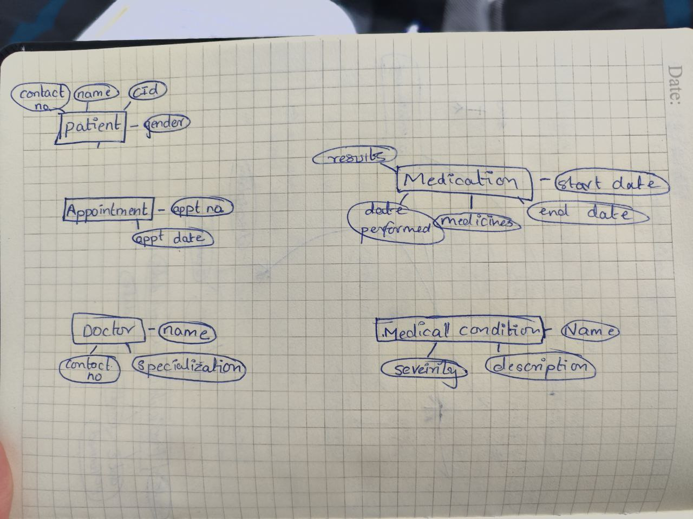

# Entity relationship diagrams (ERD)

It is a type of flowchart that illustrates the relationship between entities. Each of these entities and its related entities are denoted using simple shapes containing text labels and are connected using straight lines. ERDs provide a visual way to get the structure of a database and they are essential in the process of designing, analyzing and communicating about the database.

## Entity 
Entities can be objects or things with independent existence. They are much more like “ Noun '' in the ERD model. Entities are denoted by rectangle; rectangle is labeled with name inside indicating the concept that is being modeled. 

Entity type: things that can be defined such as teacher and student
Entity set: things that can be defined at the particular point of time
Entity categories: things can be categories into strong, weak and associative entities.
Strong entity: are defined solely by its own attributes.
Weak entity: are defined using attributes of strong entities. 
                   : notate it using a rectangle with a double lining.

Associative entity: associates the entities with the entity sets.
			    : notate it using a diamond shape within a rectangle

Entity keys: are the attributes that uniquely define the entity with the entity sets.

## Relationship
It defines how the entities are associated with each other. It is illustrated with diamond or directly labeled on the connecting lines. Weak relationship are drawn as double diamond.

## Recursive relationships

When the same entity participates more than once in the relationship.

## Attributes
Entities are further described by their properties called attributes. They are denoted by oval and are attached with entities using straight lines. One entity can have as many attributes as necessary.

Descriptive attributes: property of the relationship.

Attributes categories
Simple: attributes that can't be further divided into.
Composite: attributes with sub-attributes
derived attributes: attributes calculated from another attribute.
                            : illustrated with dash oval lines.

Multi-value 
More than one attribute value

Single- value
With one attribute value

## Cardinary 
It defines the numerical attributes relationship between the two entities.
The three main cardinal relationships are one-to-one, one-to-many and many-to-many.

## ERD symbols and notations.

## During flipped class
During the second flipped class, we formed 6 groups with 4 members and were assigned to illustrate an ERD for a proposed public sector on the chart. For one hour, we discussed and analyzed the entities, relationship, attributes and cardinary for the given public sector. We drew the ERD with all requirements needed in the ERD and we had to present it to the entire class.
We also had a questions and answers section at the end of the presentation. My group got e-health:patient records for the assignment.

I personally think flipped class is really helpful for students since we get vivid concepts of lessons that were delivered when we discuss in a group and do the practicals.

