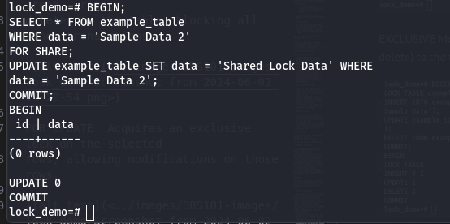

# Normalization in DBMS
Normalization is the process of organizing data in the database. It includes creating tables and establishing relationships between those according to rules designed both to protect the data and to make the database more flexiable by elimnating redundancy and inconsistent dependency.

Note
- redundant data wastes disk space and create maintenance problems. 
- inconsistent dependencies can make data difficult to access because the path to find the data may be missing or broken.

## Why we need normalization?
Normalizaton consists of series of guidelines that guides while  creating a good database by removing all the data redundancy which might lead to data integrity and other problems as the database grow.

## Types of Normal Forms

sourse: https://www.javatpoint.com/dbms-normalization

### First normal form
If a relation contains a composite or multi-valued attribute, it voilates the first normal forms. A relation is in first normal form if every attribute in that realtion is single-valued attribute. Also attribute domain should not change and each column should named uniquely. In the first normal form, the order in which data is stored does not matter.

KEY POINTS
- Eliminate repeating groups in individual tables.
- Identify each set of related data with a primary key.
- Create a seperate table for each set of related data.

Example:

Relation STUDENT in table 1 is not in 1NF because of multi-valued attribute STUD_PHONE. Its decomposition into 1NF has been shown in table 2.

### Second normal form
It is based on the concept of fully functional dependency. It applies to relation with composite keys which is realtion with a primary key composed of two or more attributes. To be in second formal form, a relation should be in the first normal               form and relation must not contain any partial dependency. 

    A relation that is in First Normal Form and every non-primary-key attribute is fully functionally dependent on the primary key, then the relation is in Second Normal Form (2NF).

KEY POINTS
- create seperate tables for set of values that apply to multiple records.
- relate these tables with a foregin key.

Example:

In the above table, we can see there is partial dependency as
StudentName and ProjectName should be functionally dependent on part of a candidate key, to be Partial Dependent.t And the StudentName can be determined by StudentID, which makes the relation Partial Dependent.

Therefore, the `<StudentProject>` relation violates the 2NF in Normalization and is considered a bad database design.

To remove Partial Dependency and violation on 2NF, decompose the above tables

Now the relation is in second normal form of Database normalization.

### Third normal form
A relation is in the third normal form, if there is no transitive dependency for non-primary attributes as well as it is in the second normal form. 

KEY POINT
- eliminate fields that don't depend on the key 

#### What is transitive dependency?
It refers to some non-prime attribute other than the candidate key that depends on another non-prime attribute that is dependent on the candidate key.

3NF is a curcial stage in database normalization. It deals with transitive dependencies and improves data integrity through effective information organization.

Example:

We can conclude that primary key is EMP_ID.

But here, EMP_STATE and EMP_CITY depends on EMP_ZIP and it ultimately depends on EMP_ID. so, non-primary key EMP_ZIP is acting as primary key to EMP_STATE and EMP_CITY. It voilates the rule of third normal form.

That's why we need to move the EMP_CITY and EMP_STATE to the new <EMPLOYEE_ZIP> table, with EMP_ZIP as a Primary key.

Now the tables in third normal form.

### Boyce-Codd Normal Form (BCNF)
It is a slightly stronger version of the third normal form. A relation is said to be in BCNF if the tables are in 3NF and every Right-hand Side attribute of the functional dependencies is depending on the super key of that particular table.

Example:

From the above table we can conclude that;

Functional dependencies are: EMP_ID  - EMP_COUNTRY  and EMP_DEPT -{DEPT_TYPE, EMP_DEPT_NO}

Candidate key: EMP_ID and EMP_DEPT

The table is not in BCNF beacuse neither EMP_DMPT nor EMP_ID alone are keys. Hence, it voilates the BCNF law. We can decomposite it into three tables to be in BCNF 

### Forth normal form
It is the level of database normalization where there are no non-trivial multivalued dependencies other than the candidate key. 

A relation is in fourth normal form if:
- it should be in the Boyce-Codd Normal Form (BCNF)
- The table should not contain any multi-valued dependency.

#### What is multi-valued dependency?
Multi-valued dependecy occurs when the single value of column A has multiple value of column B. And it also occurs when a relation consist of at-least 3 columns and the column Aand B, B and C are independent of each other. 

Example:

As we can seee in the table above, student 21 has opted for two course, Computer and math, and aslo has two hobbies, Dancing and Singing. And there is no relation between the column course and hobby. So, there is multi-valued depenency which voilates the fourth normal rule.

To make the relation in fourth normal form, we can decomposite the table into two tables.

Now, there is no multi-valued dependency and the relation is in fourth normal form.

## Advantages of normalization
- helps to minimize data redundancy.
- data consitency within the database.
- much more flexible database design.
- greater overall database organization.

# what we did during flipped class
During this flipped class, we were assigned to groups of four with six members and had to discuss the given topics. Since the instructions and reading materials were already uploaded the day before the flipped class we all were prepared for the class. After discussing it in the group we had to present it to the class. Flipped class sessions have improved a lot compared to the beginning and Presenting contents to the class is another way of proving ourselves. 